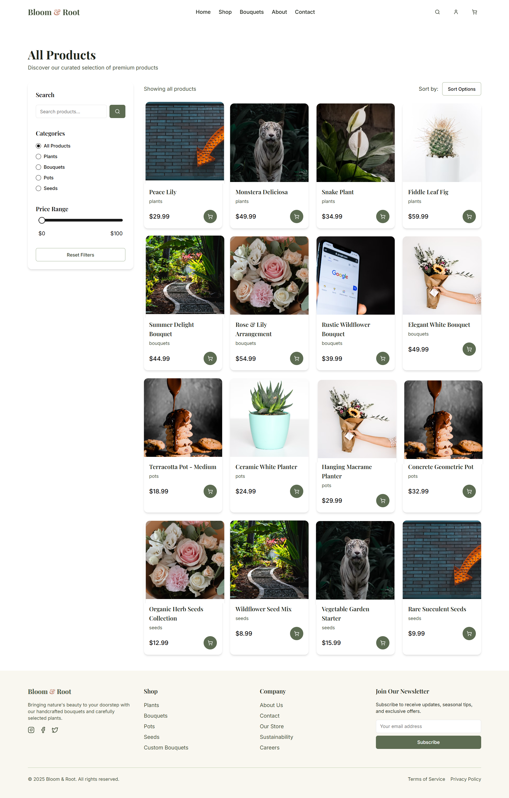

# 🌿 Bloom & Roots

**Bloom & Roots** is a beautifully crafted minimalist shopping experience where users can explore and shop for **plants, seeds, pots, and custom bouquets**. Thoughtfully designed with a nature-inspired aesthetic, this responsive web app offers smooth navigation, filtering, and a delightful user experience.

---

## 🌸 Features

- 🪴 Browse curated categories: Plants, Seeds, Pots, Bouquets
- 🌼 Build your own bouquet with a live preview
- 🧩 Filter and sort products by type, price, and availability
- 💚 Smooth and responsive user experience
- 🌙 Beautiful soft UI with calming tones

---

## 🔧 Tech Stack

- **Vite + React + TypeScript**
- **Tailwind CSS** for styling
- **shadcn/ui** for prebuilt accessible components
- **React Router** for navigation
- **Custom Hooks** and clean modular structure

---

## 🎬 Demo

Watch the live walkthrough on YouTube:  
👉 [Click here to watch the demo]([https://www.youtube.com/watch?v=YOUR_VIDEO_LINK](https://youtu.be/_V_C7uU15lk))

